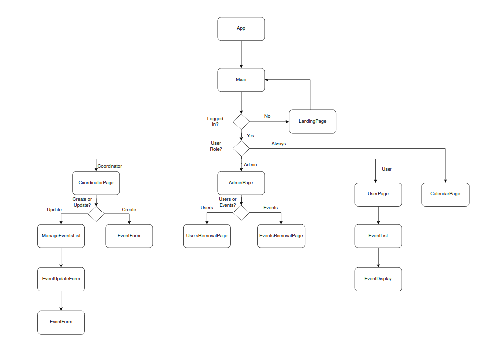

# isea-frontend
The frontend for isea

## Setup

1. `git clone git@github.com:team-3-cs633/isea-frontend.git`
2. `cd isea-frontend`

## Running  

Run `npm start`

## Testing  

TBD   

## Formatting 

TDB   

## UI Component Diagram

